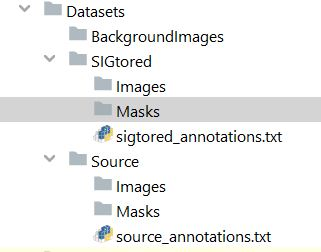
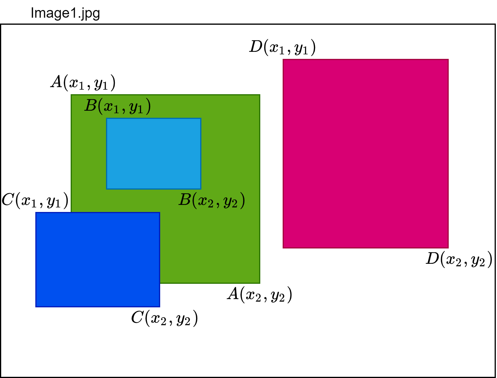
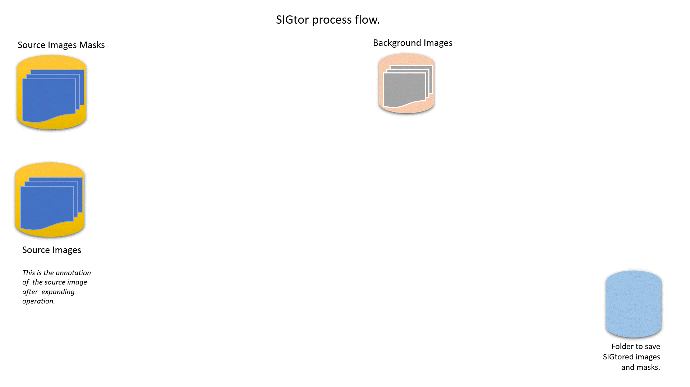

# SIGtor: Supplimentary Synthetic Image Generetion for Object Detection and Segmentation Datasets

## Introduction

One of the challenges in deep learning tasks, whether it is classification, detection or segmentation, is the need for
huge collection of well-balanced training data. Especially, this challenge becomes serious when it comes to the latter
two tasks as creating large training dataset for these tasks is a dauntingly tedious and error-prone process. As a
result, data augmentation has become an indispensable part of training deep learning models so that the small datasets
one has acquired gets multiplied with various morphological or geometrical tweaking, either on fly during training
process or offline.

Here, I want to show how it is possible to artificially generate, theoretically an infinite number of, new supplementary
artificial datasets for object detection or segmentation challenge from a given existing small(in fact the size doesn’t
matter as long as one needs more) dataset. The algorithm I am about to share is a simple copy-paste based augmentation
but very robust in handling object overlapping, dynamic placement on a given background image and supports object level
individual augmentation as well as image wide augmentation. The synthetically generated images will have instance
segmentation masks and tightly fit bounding boxes. Let us (me &#x1F60F;) call the overall system SIGtor, to mean
Synthetic-Image-Generator.

## Assumptions

<ol>
<li>
You have a dataset you wanted to artificially extend using SIGtor. <b><i>Note that</i></b> SIGtor is an offline dataset generator not an augmentation technique you use while training a deep learning model. The generated images, however, with or without the original images can be used to train a model.
</li>
<li>
Your dataset should be annotated in YOLO formant with bounding boxes annotated as: 

<ul> 
  

    ./Datasets/Source/Images/image1.jpg $x_1,y_1,x_2,y_2,A\ x_1,y_1,x_2,y_2,B\ x_1,y_1,x_2,y_2,C\ x_1,y_1,x_2,y_2,D$  
  

</ul>

For this demo I will use Pascal VOC or COCO Object Detection and Instance Segmentation Mask downloaded from Kaggle or COCO dataset site. The tools to convert either Pascal VOC or COCO dataset into YOLO format is found in tools folder of this project.

Though may not necessarily be in the project folder, one can consider arranging folders as shown in the figure below.

 
<ul>

 
</ul>
</li>
<li>
Download some images from the internet that can be used as a background image and keep it under BackgroundImages folder as shown in the figure above. (Where you put it is up to you as long as you gave the right directory in the project). The background images are not mandatory for the project but is good to create realistic and real world looking artificial images rather than using a plain background. There are many ways to automate the download process such as <a href="https://github.com/hardikvasa/google-images-download"> here </a> or <a href="https://levelup.gitconnected.com/how-to-download-google-images-using-python-2021-82e69c637d59"> here</a>. Once the background images are downloaded, manually remove background images that have objects from your datasets classes. (This is an essential step as you might not want unannotated objects in your training dataset confusing your model’s loss functions).
</li>
</ol>

## SIGtor: The Steps

Synthetic image generation has two steps.
<ul>

<li> Step 1: Expand the source annotation. </li>

Take for example the above image has four objects (A, B, C and D) annotated as:
./Datasets/Source/Images/image1.jpg $x_1,y_1,x_2,y_2,A\ x_1,y_1,x_2,y_2,B\ x_1,y_1,x_2,y_2,C\ x_1,y_1,x_2,y_2,D$  
  
<i>(Of course A, B, C, D will be the object classes integer index and the coordinates will be different according to the
objects actual coordinates!)</i>

The expand_annotation.py file will take in such annotations, and automatically calculates the IoU of each object against
each other, re-annotates the line into several annotation lines so that:

<ul>
<li> non-overlapping objects gets their own annotation line, like the case with object <b>D</b>.</li>
<li> object completely embedded within coordinate of other bigger object (e.g. object <b>B</b> completely within the coordinate of <b>A</b>), also gets its own annotation line.</li>
<li> bigger objects with other inner objects (e.g. <b>A</b> and <b>B</b>'s relationship) or partially overlapping with other objects (e.g. <b>A</b> and <b>C</b>'s relationship) should be annotated in the same line.

</ul>

Therefore, after expanding the above annotation line will have at least three annotation lines as in below.

./Datasets/Source/Images/image1.jpg $x_1,y_1,x_2,y_2,B$ 
./Datasets/Source/Images/image1.jpg $x_1,y_1,x_2,y_2,D$ 
./Datasets/Source/Images/image1.jpg $x_1,y_1,x_2,y_2,A\ x_1,y_1,x_2,y_2,B\ x_1,y_1,x_2,y_2,C$ 

To accomplish this first step, we simply run the expand_annotation.py file with command line arguments or without, given
that we edited the sig_argument.txt file with the correct inputs.

 

<li> Step 2: Generate the artificial images. </li>

The detail of this ... I leave it to the below gif &#x1F62B; phew.

 

</ul>

Some sample SIGtored images and masks are found in projects Datasets/SIGtored folder. To generate new artificial images
one can, clone this project and run synthetic_image_generator.py as it is. To work on your own dataset or other public
datasets like COCO and VOC for your next object detection or segmentation training, edit sig_argument.txt file
accordingly and follow the above two steps.

# Conclusion

This experimental project has helped me train YOLOv3 and my own version of YOLOv3 called MultiGridDet and DenseYOLO, my
lighter version of YOLOv2 implementation, to get few extra percentages of accuracies compared to the original work of
the authors of YOLO and has lead me to believe that copy-paste augmentation is really phenomenal for training deep
learning models. However,

<ol>
<li> One must pay attention not to over represent certain set of object classes. Though I removed part of the project that under-samples over-represented classes such as Person and Car to even out or reduce the imbalance, one is free to experiment with such features.</li>
<li> One must make sure that the training dataset is NOT too repetitive resulting in an overfitting problem.</li>
</ol>

Finally, I attest that I haven't observed an impact or (significant scale of impact) on the performance of the models I
trained due to the remaining artifacts of the SIGtored objects or lack of somewhat seamlessness of the pasting. However,
the longer you train the model the more easily the network starts to pick those objects, but again that is always the
case when your model learns too many details of your training dataset.
